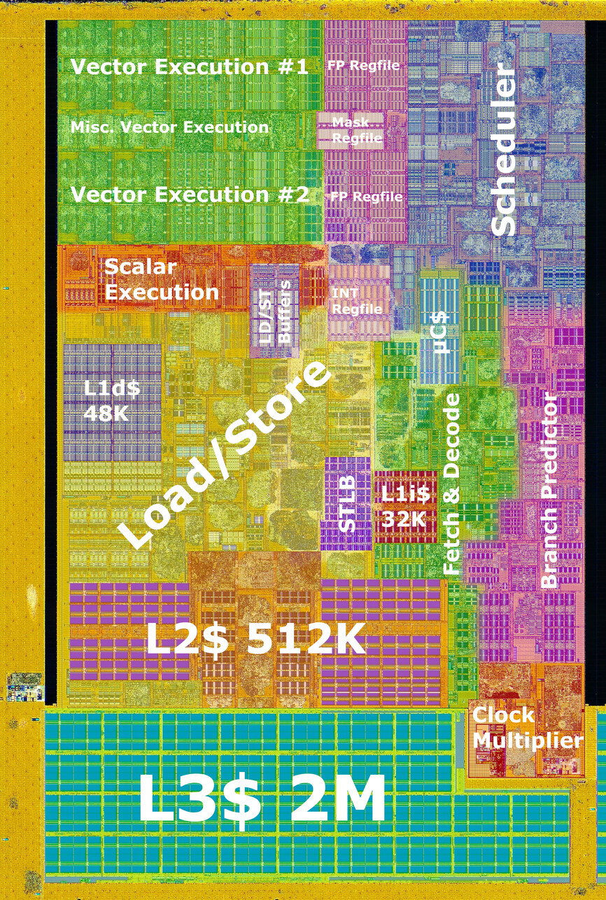
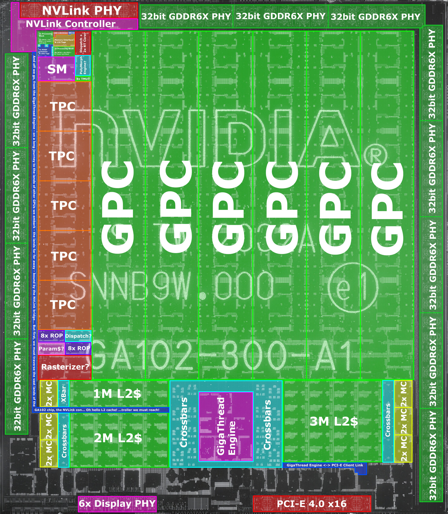
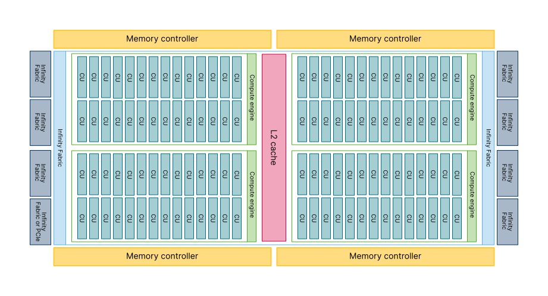
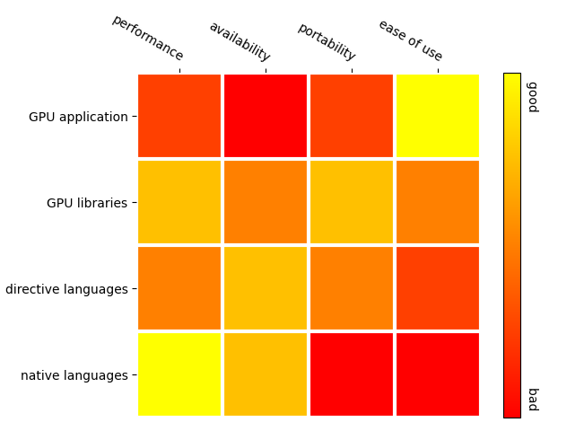

# High Performance Computing through the ages

- Various strategies to achieve performances through the years:
    - Frequency, vectorization, multi-node, multi-core ...
- Today performance is mostly limited by power consumption

# Accelerators

- Specialized hardware for vectorised floating point operations
    - Co-processors for traditional CPUs
    - Based on highly parallel architectures
    - Graphics processing units (GPU) have been the most common
      accelerators during the last few years
- Promises
    - Very high performance per node
    - More FLOPS/Watt
- Usually major rewrites of programs required

# Trends in HPC: GPUs are becoming the norm

{.center width=70%}

- over 70% of top 500 supercomputers use GPUs

# Different design philosophies: CPU

**CPU**

- General purpose
- Low latency per thread
- Large area dedicated to caches and control
    - Good for control-flow
    - Great for task parallelism (MIMD)
- Less silicon dedicated at Arithmetic-Logic Units (ALU)
    - Bad with parallel execution

{width=57%}

# Different design philosophies: GPU

**GPU**

- Most of the silicon dedicated to ALUs
    - Hundreds of floating-point execution units
    - Highly specialized for parallelism
- Great for data parallelism
- High-throughput
- Bad at control-flow processing

{width=70%}

# Flynn's taxonomy

- Proposed in 1966 to classify compute units

{height=200px} 
Single
Instruction
Single
Data
 
 
{height=200px} 
Single
Instruction
Multiple
Data

{height=200px} 
Multiple
Instructions
Single
Data
 
 
{height=200px} 
Multiple
Instructions
Multiple
Data

# Flynn's taxonomy

- Proposed in 1966 to classify compute units

{height=200px} 
SISD:
single CPU core 
 
{height=200px} 
SIMD:
GPUs, SSE, AVX, ...

{height=200px} 
MISD:
-- 
 
{height=200px} 
MIMD:
multi-core CPUs

# GPU architecture

::::::{.columns}
:::{.column width=40%}
- Designed for running tens of thousands of threads simultaneously on
  thousands of cores
- Very small penalty for switching threads
- Running large amounts of threads hides memory access penalties
:::
:::{.column width=58%}

Overview of a MI250x Graphics Compute Die  
(<https://docs.lumi-supercomputer.eu/hardware/lumig/>)

:::
::::::

- Very expensive to synchronize all threads

# LUMI supercomputer hardware

{.center width=100%}

## LUMI-G
{.center width=90%}

## LUMI-C
- 2048x nodes
- 2x AMD EPYC 7763 64-core CPU

# LUMI-G node

- GPU is connected to CPUs via Infinity Fabric
- Local memory in GPU
    - Smaller than main memory (64 GB per GCD)
    - Very high bandwidth (up to 3200 GB/s)
    - Latency high compared to compute performance
- Data must be copied from CPU to GPU over the Infinity Fabric

{width=70%}
{width=70%}

# Performance considerations

- Memory accesses:
  - data resides in the GPU memory; maximum performance is achieved when
    reading/writing is done in continuous blocks
  - very fast on-chip memory can be used as a user programmable cache
- *Unified Virtual Addressing* provides unified view for all memory
  - may hurt performance
- Asynchronous calls can be used to overlap transfers and computations

# GPU programming approaches {.section}

#  Heterogeneous Programming Model

- GPUs are co-processors to the CPU
- CPU controls the work flow:
  - *offloads* computations to GPU by launching *kernels*
  - allocates and deallocates the memory on GPUs
  - handles the data transfers between CPU and GPUs
- CPU and GPU can work concurrently
   - kernel launches are normally asynchronous

# Performance portability in the GPU age

- CPUs are easy, GPUs a bit harder
- How to support different GPU architectures?
  

  1. use accelerated GPU libraries: cublas, rocsolver, ...
  2. use a high-level abstraction layer
     - directive based methods: OpenMP, OpenACC
     - programming models: SYCL, Kokkos, Raja, ...
  3. use native GPU programming
     - CUDA, HIP
  

# Native GPU code: HIP / CUDA

- CUDA
    - has been the *de facto* standard for native GPU code for years
    - extensive set of optimised libraries available
    - custom syntax (extension of C++) supported only by CUDA compilers
    - support only for NVIDIA devices
- HIP
    - AMD effort to offer a common programming interface that works on
      both CUDA and ROCm devices
    - standard C++ syntax, uses nvcc/hcc compiler in the background
    - almost a one-on-one clone of CUDA from the user perspective
    - ecosystem is new and developing fast

# Hipify: CUDA ⇒ HIP conversion

- AMD toolset to convert C/C++ CUDA code into HIP
  - aims to be automatic, but it is possible that not all code is converted
    and manual fixing is required post-conversion
  - `hipify-perl`: text-based search and replace
  - `hipify-clang`: source-to-source translator based on LLVM

- CUDA Fortran can be translated to HIP (hipfort) using another
  source-to-source translator called `GPUFORT`

# OpenMP and OpenACC: Compiler directives

- annotate code with directives that instruct the compiler on how to
  parallelise the code, or how to offload computing to the GPU
  - if compiled without OpenMP/OpenACC, directives are ignored
- same code can in principle be run on all systems
  - requires compiler support!
- OpenMP
  - good support on many recent HPC systems
- OpenACC
  - similar to OpenMP, but development driven by NVIDIA
  - LUMI: supported only for Fortran

# Directive languages and performances

- "Write once, run everywhere"
  - it is true that you get portability
  - it is *not* true that you get *performance* portability

- It is possible to optimize a code for performance on the GPU!
  - many optimisations will increase the performance also on the CPU
  - however, a highly optimised code will most likely be slower on the CPU

# Kokkos and SYCL: Portable C++ programming models

- Kokkos
  - hardware details taken care of by the framework
  - special syntax in the code to express parallelism and data dependencies
  - very good support of all architectures

- SYCL
  - generic programming with templates and lambda functions (compiler takes care of hardware details)
  - AdaptiveCpp (aka hipSYCL) supports both AMD and NVIDIA GPUs
  - the programming model for Intel GPUs
  - lot of effort invested in SYCL, future looks optimistic

# Which programming approach to choose?

:::::: {.columns}
::: {.column width=58%}
{.center width=100%}
:::
::: {.column width=40%}
 

- Current code base
  - Extensive code rewriting is time-consuming
- Long-term perspective
  - Portable code also for future HPC systems
:::
::::::

# GPUs @ CSC

- **Puhti-AI**: 80 nodes, total peak performance of 2.7 Petaflops
    - Four Nvidia V100 GPUs, two 20-core Intel Xeon processors, 3.6 TB fast
      local storage, network connectivity of 200Gbps aggregate bandwidth
- **Mahti-AI**: 24 nodes, total peak performance of 2.0 Petaflops
    - Four Nvidia A100 GPUs, two 64-core AMD Epyc processors, 3.8 TB fast
      local storage,  network connectivity of 200Gbps aggregate bandwidth
- **LUMI-G**: 2978 nodes, total peak performance of 500 Petaflops
    - Four AMD MI250X GPUs, one 64-core AMD Epyc processors, no local
      storage, network connectivity of 800Gbps aggregate bandwidth

# Summary

- GPUs provide significant speed ups for certain applications
- GPUs are co-processors to CPUs
   - CPU offloads computations and manages memory
- High amount of parallelism required for efficient utilization of GPUs
- Programming GPUs
    - Directive based methods
    - CUDA, HIP
