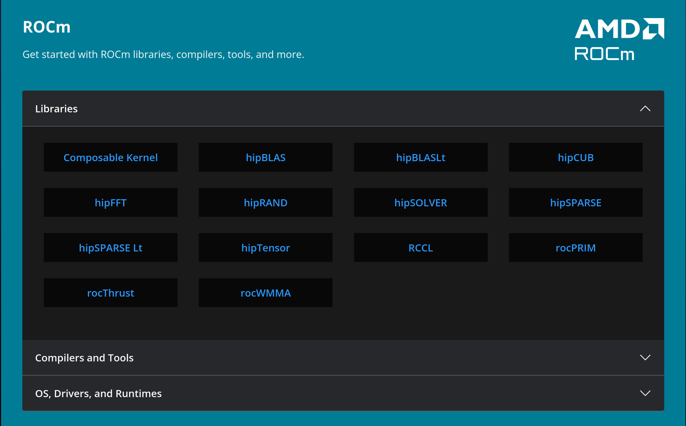

# CUDA

::: incremental
- Software stack offering tools for programming Nvidia GPUs
- CUDA includes C++ runtime API **and** a kernel programming language
- standard C++ syntax, `nvcc` compiler driver is used to compile code
    - nvcc uses a CPU compiler, e.g. `g++` in the background for compiling CPU code
:::

# CUDA libraries

:::::: {.columns}
::: {.column width="40%"}
- Nvidia offers many libraries optimized for GPU code
- https://developer.nvidia.com/gpu-accelerated-libraries
- not covered during this lecture
:::
::: {.column width="60%"}
{.center width=100%}
:::
::::::

# ROCm

::: incremental
- Software stack offering tools for programming AMD GPUs
- ROCm provides the tools for HIP, OpenCL and OpenMP
    - compilers, libraries for high-level functions, debuggers, profilers and runtimes
- ROCm is **not** a programming language
:::

# ROCm libraries

:::::: {.columns}
::: {.column width="40%"}
- AMD offers also a wide set of optimised libraries and tools
- https://www.amd.com/en/products/software/rocm/hpc.html
- not covered during this lecture
:::
::: {.column width="60%"}
{.center width=100%}
:::
::::::

# HIP

::: incremental
- HIP = Heterogeneous-computing Interface for Portability
- AMD effort to offer a common programming interface that works on both
      Nvidia and AMD devices
- almost a one-to-one clone of CUDA from the user perspective
- standard C++ syntax, `hipcc` wrapper for compiling
    - uses `nvcc`/`clang++` compilers behind the scenes
- allows one to write portable GPU code
:::

# GPU terminology

::: incremental
- compute unit (CU, AMD) / streaming multiprocessor (SM, Nvidia)
    - a simple processor on a GPU
    - contains multiple independent vector units
- kernel
    - parallel function executed on the GPU
- thread
    - individual worker of a wavefront/warp (AMD/Nvidia)
:::

# GPU terminology

::: incremental
- wavefront/warp (AMD/Nvidia)
    - collection of threads: execute the same instruction in lockstep
    - fixed number of threads (AMD: 64, NVIDIA 32)
    - threads per block is chosen at kernel launch
        - wavefronts per block = threads per block / 64
- workgroup/block of threads (AMD/Nvidia)
    - group of threads partitioned to wavefronts/warps
    - execute on the same CU/SM (AMD/Nvidia)
    - can synchronise together and communicate through memory in the CU/SM (AMD/Nvidia)
:::

# HIP/CUDA programming model

::: incremental
- GPU accelerator is often called a *device* and CPU a *host*
- parallel code:
    - launched by the host using the API
    - written using the kernel language
    - from the point of view of a single thread (each thread has a unique ID)
    - executed on a device by many threads
:::

# GPU programming considerations

::: incremental
- parallel nature of GPUs requires many similar tasks that can be executed simultaneously
    - one usage is to replace iterations of loop with a GPU kernel call
- need to adapt CPU code to run on the GPU
    - algorithmic changes to fit the parallel execution model
    - share data among hundreds of cooperating threads
    - manage data transfers between CPU and GPU memories
      carefully (a common bottleneck)
:::

# API

Code on the CPU to control the larger context and the flow of execution

::: incremental
- device init and management: `hipSetDevice`/`cudaSetDevice`
- memory management: `hipMalloc`/`cudaMalloc`
- execution control: `kernel<<<blocks, threads>>>`
- synchronisation: device, stream, events: `hipDeviceSynchronize`/`cudaDeviceSynchronize`
- error handling, context handling, ... : `hipGetErrorString`/`cudaGetErrorString`

- documentation: [HIP docs](https://rocm.docs.amd.com/projects/HIP/en/latest/reference/hip_runtime_api/modules.html#modules-reference) & [CUDA docs](https://docs.nvidia.com/cuda/cuda-runtime-api/index.html)
:::

# API example: Hello world

```cpp
#include <hip/hip_runtime.h>
#include <stdio.h>

int main(void)
{
    int count = 0;
    auto result = hipGetDeviceCount(&count);

    int device = 0;
    result = hipGetDevice(&device);

    printf("Hello! I'm GPU %d out of %d GPUs in total.\n", device, count);

    return 0;
}
```

# Kernels

Code on the GPU from the point of view of a single thread

::: incremental
- kernel is a function executed by the GPU
- kernel must be declared with the `__global__` attribute and the return type must be `void`
- any function called from a kernel must be declared with `__device__` attribute
- all pointers passed to a kernel should point to memory accessible from
  the device
- unique thread and block IDs can be used to distribute work
:::

# Kernel language

::: incremental
- attributes: `__device__`, `__global__`, `__shared__`, ...
- built-in variables: `threadIdx.x`, `blockIdx.y`, ...
- vector types: `int3`, `float2`, `dim3`, ...
- math functions: `sqrt`, `powf`, `sinh`, ...
- atomic functions: `atomicAdd`, `atomicMin`, ...
- intrinsic functions: `__syncthreads`, `__threadfence`, ...
:::

# Kernel example: axpy

$$\vec{y} = \alpha \vec{x} + \vec{y}$$
```cpp
__global__ void axpy(int n, double a, double *x, double *y)
{
    const int tid = threadIdx.x + blockIdx.x * blockDim.x;

    if (tid < n) {
        y[tid] += a * x[tid];
    }
}
```

::: incremental
- global ID `tid` calculated based on the thread and block IDs
- only threads with `tid` smaller than `n` calculate
- works only if number of threads ≥ `n`
:::


# Kernel example: axpy (revisited)

```cpp
__global__ void axpy(int n, double a, double *x, double *y)
{
    const int tid = threadIdx.x + blockIdx.x * blockDim.x;
    const int stride = blockDim.x * gridDim.x;

    for (int i = tid; i < n; i += stride) {
        y[i] += a * x[i];
    }
}
```

- handles any vector size, but grid size should still be chosen with some care

# Launching kernels

::: incremental
- kernels are launched with one of the two following options:
  - CUDA syntax (recommended, because it works both on CUDA and HIP):
  ```cpp
  axpy<<<blocks, threads, shmem, stream>>>(args)
  ```
  
  - HIP syntax:
  ```cpp
  hipLaunchKernelGGL(axpy, blocks, threads, shmem, stream, args)
  ```

- grid dimensions are obligatory
    - must have an integer type or vector type of `dim3`
- `shmem`, and `stream` are optional arguments for CUDA syntax, and can be `0` for the HIP syntax
- kernel execution is asynchronous with the host
:::

# Grid: thread hierarchy

Kernels are executed over a grid:

- grid consists of equisized blocks of threads
- grid size & dimensionality is set at kernel launch
```cpp
// num blocks in grid
dim3 blocks(10, 1, 1);

// num threads in block
dim3 threads(1024, 1, 1);

// 10 blocks in a grid, every block is the same size (1024).
// In total 10 x 1024 = 10240 threads over the entire grid.

// Launch 'axpy' over a grid defined by 'blocks' and 'threads'
// with arguments 'args'
axpy<<<blocks, threads>>>(args)
```

# Grid: thread hierarchy

- threads execute the kernel, grid describes the size & dimensions
- built-in variables in a kernel: `threadIdx`, `blockIdx`, `blockDim`, `gridDim` relate to the dim3 variables used at kernel launch
```cpp
__global__ void axpy(int n, double a, double *x, double *y)
{
    // If launched with:
    // dim3 blocks(10, 1, 1);
    // dim3 threads(1024, 1, 1);
    // axpy<<<blocks, threads>>>(...);

    const int tid = threadIdx.x + blockIdx.x * blockDim.x;
    //              ^ [0, 1023]  ^ [0, 9]      ^ 1024 
    const int stride = blockDim.x * gridDim.x;
    //                 ^ 1024       ^ 10
}
```

# Memory management

- GPU has its own memory area
- allocate device usable memory with `hipMalloc`/`cudaMalloc` (cf. `std::malloc`)
- pass the pointer to the kernel
\ 
\ 
```cpp
const size_t num_bytes = sizeof(double) * n;
void *dx = nullptr;
hipMalloc(&dx, num_bytes);
```

# Memory management

- copy data to/from device: `hipMemcpy`/`cudaMemcpy` (cf. `std::memcpy`)
\ 
\ 
```cpp
// Explicit copy direction with the 'kind' parameter
hipMemcpy(dx, x, num_bytes, hipMemcpyHostToDevice);
hipMemcpy(x, dx, num_bytes, hipMemcpyDeviceToHost);

// Implicit copy direction, runtime figures it out
// from the virtual address of the pointer.
// Recommended: dst and src pointers that do not match
// the hipMemcpyKind results in undefined behavior.
hipMemcpy(dx, x, num_bytes, hipMemcpyDefault);
hipMemcpy(x, dx, num_bytes, hipMemcpyDefault);
```

# Error checking

- always use error checking with larger codebases!
  - it has low overhead, and can save a lot of debugging time!
- some exercises of this course do not have error checking, mostly to focus on the taught topic

```cpp
#define HIP_ERRCHK(result) hip_errchk(result, __FILE__, __LINE__)
static inline void hip_errchk(hipError_t result, const char *file, int line) {
    if (result != hipSuccess) {
        printf("\n\n%s in %s at line %d\n", hipGetErrorString(result), file, line);
        exit(EXIT_FAILURE);
    }
}

// Wrap API call with the macro
HIP_ERRCHK(hipMalloc(&ptr, bytes));

```

# Error checking kernel launch

- kernel launches may fail due to bad conf param: catch with macro!

```cpp
#define LAUNCH_KERNEL(kernel, ...) launch_kernel(#kernel, __FILE__, __LINE__, kernel, __VA_ARGS__)
template <typename... Args>
void launch_kernel(const char *kernel_name, const char *file, int32_t line,
                   void (*kernel)(Args...), dim3 blocks, dim3 threads,
                   size_t num_bytes_shared_mem, hipStream_t stream, Args... args) {
    auto result = hipGetLastError();
    kernel<<<blocks, threads, num_bytes_shared_mem, stream>>>(args...);
    result = hipGetLastError();
    if (result != hipSuccess) {
        printf("Error with kernel \"%s\" in %s at line %d\n%s: %s\n",
               kernel_name, file, line, hipGetErrorName(result),
               hipGetErrorString(result));
        exit(EXIT_FAILURE);
    }
}
```

# Example: fill (complete device code and launch)

```cpp
#include <hip/hip_runtime.h>
#include <stdio.h>
#include <vector>
#include <error_checking.hpp>

__global__ void fill(int n, double a, double *x) {
    const int tid = threadIdx.x + blockIdx.x * blockDim.x;
    const int stride = gridDim.x * blockDim.x;

    for (int i = tid; i < n; i += stride)
        x[i] = a;
}
```

# Example: fill (complete device code and launch)

```cpp
int main() {
    static constexpr size_t n = 10000;
    static constexpr size_t num_bytes = n * sizeof(double);
    static constexpr double a = 3.4;

    double *d_x = nullptr;
    HIP_ERRCHK(hipMalloc(&d_x, num_bytes));

    const int threads = 256;
    const int blocks = 32;
    LAUNCH_KERNEL(fill, blocks, threads, 0, 0, n, a, d_x));

    std::vector<double> x(n);
    HIP_ERRCHK(hipMemcpy(x.data(), d_x, num_bytes, hipMemcpyDefault));

    printf("%f %f %f %f ... %f %f\n", x[0], x[1], x[2], x[3], x[n-2], x[n-1]);
}
```

# Summary

::: incremental
- CUDA and HIP are low level GPU programming APIs
- ROCm is a software stack providing the tools for programming AMD GPUs
- HIP supports both AMD and NVIDIA devices
- CUDA and HIP consist of an API and a kernel language
    - API controls the larger context
    - kernel language for single thread point of view GPU code
- kernels execute over a grid of (blocks of) threads
    - each block is executed in wavefronts of 64 (AMD) or 32 (NVIDIA) threads
- kernels need to be declared `__global__` and `void` and are launched with special syntax
:::
