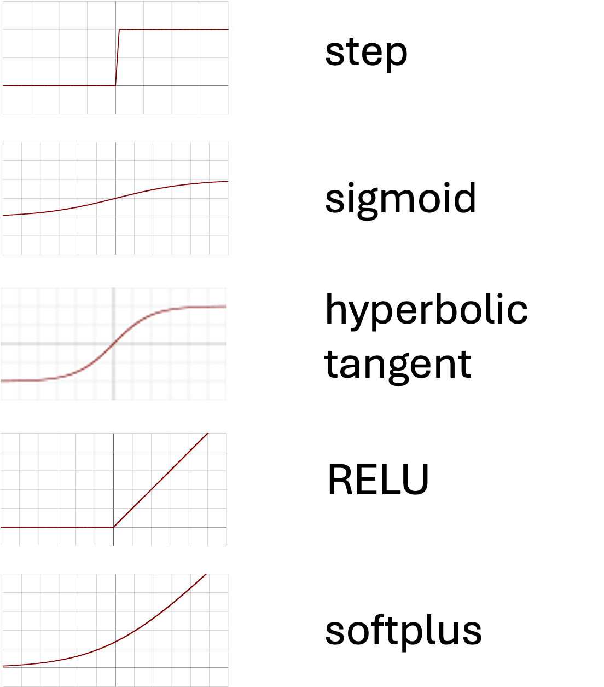

# Machine Learning

- learn patterns from data to make predictions on unseen data

<div class="column"  style="width:99%; text-align: center;">
  {width=61%}
  
  <small>**The unreasonable effectiveness of data in machine learning!**</small>
</div>


# Generalization, Overfitting, Regularization

- quality of a model is measured on new, unseen samples
- too simple models fail to describe the model
- models with too many parameters can overfit to training data
- overfitting can be prevented by regularization

<div class="column"  style="width:99%; text-align: center;">
  {width=64%}

  <small>From Wikimedia Commons, [CC BY-SA 4.0](https://creativecommons.org/licenses/by-sa/4.0/)</small>
</div>

# Artificial Neurons

<div class="column"  style="width:55%">
  {width=89%}

  <small>From Wikimedia Commons, [CC BY-SA 4.0](https://creativecommons.org/licenses/by-sa/4.0/)</small>

  $\Sigma_j=w_{0j}+x_1w_{1j}+x_2w_{2j}+...+x_nw_{nj}$

  $\boldsymbol{\phi}=f(\Sigma_j)$
</div>
<div class="column"  style="width:39%">
  {w\Sigma_jidth=69%}

  <small>From Wikimedia Commons, [CC BY-SA 4.0](https://creativecommons.org/licenses/by-sa/4.0/)</small>
</div>


# Neural Networks

# Pytorch Example
Example of a model with 3 layers. 
<div class="column"  style="width:75%">
```python
class SimpleMLP(nn.Module):
    def __init__(self):
        super().__init__()
        self.layers = nn.Sequential(
            nn.Linear(784, 128),
            nn.ReLU(),
            nn.Linear(128, 20),
            nn.ReLU(),
            nn.Linear(20, 10),
            nn.Softmax(dim=1)
        )
    def forward(self, x):
        return self.layers(x)
```
</div>

<div class="column"  style="width:23%; text-align: center;">
{width=39%}
</div>

Final result is given by softmax operation: $y(\mathbf{z})=\frac{e^{z_j}}{\Sigma_k e^{z_k}}$

# Learning as an Optimization Problem

# Forward Pass

# Backward Pass


# Summary
