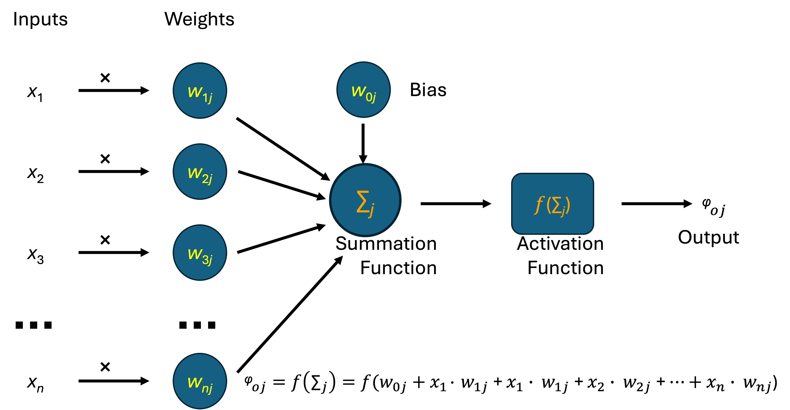
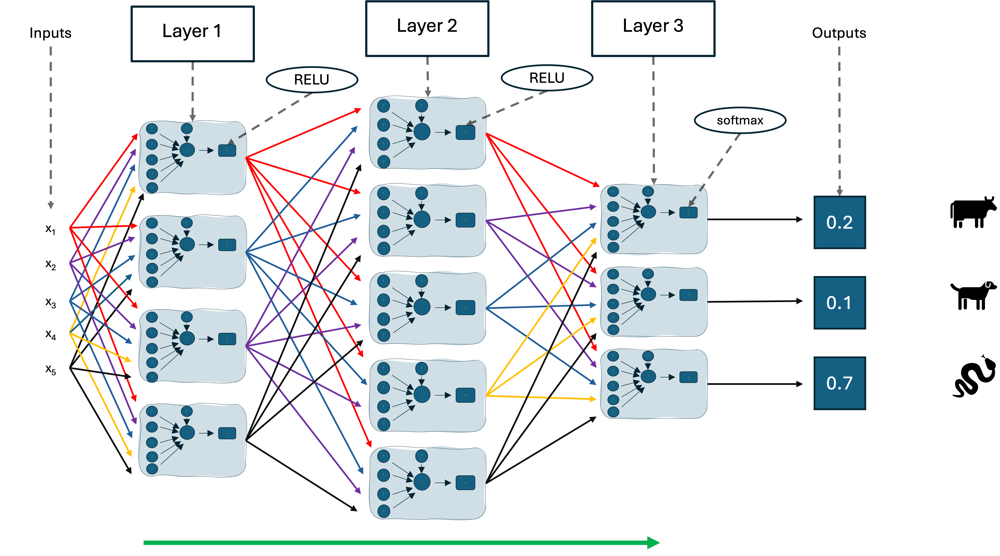

# Machine Learning

- learn patterns from data to make predictions on unseen data

<div class="column"  style="width:99%; text-align: center;">
  {width=61%}
  
  <small>**The unreasonable effectiveness of data in machine learning!**</small>
</div>


# Generalization, Overfitting, Regularization

- quality of a model is measured on new, unseen samples
- too simple models fail to describe the model
- models with too many parameters can overfit to training data
- overfitting can be prevented by regularization

<div class="column"  style="width:99%; text-align: center;">
  {width=64%}

  <small>From Wikimedia Commons, [CC BY-SA 4.0](https://creativecommons.org/licenses/by-sa/4.0/)</small>
</div>

# Artificial Neurons

<div class="column"  style="width:57%">
  {width=125%}
</div>
<div class="column"  style="width:39%; text-align: center;">
  {width=65%}
</div>


<div class="column"  style="width:99%; text-align: center;">

  <small>From Wikimedia Commons, [CC BY-SA 4.0](https://creativecommons.org/licenses/by-sa/4.0/)</small>
</div>

#  Neural Networks

<div class="column"  style="width:58%">
  {width=90%}
</div>

<div class="column"  style="width:40%">

  - <small>the inputs and outputs are vectors </small>
  - <small>each layer $j$ is a matrix of size $l_{i}\times l_j$</small>
  - <small>RELU and softmax are functions operating on each value of the argument</small>

</div>

  - a prediction is comprised of a sequence of vector-matrix multiplications, each followed by an activation function call

    
# Forward Pass. Pytorch Example
 
<div class="column"  style="width:75%">
```python
class SimpleMLP(nn.Module):
    def __init__(self):
        super().__init__()
        self.layers = nn.Sequential(
            nn.Linear(5, 4),
            nn.ReLU(),
            nn.Linear(4, 5),
            nn.ReLU(),
            nn.Linear(5, 3),
            nn.Softmax(dim=1)
        )
    def forward(self, x):
        return self.layers(x)
```
</div>

<div class="column"  style="width:23%; text-align: center;">
{width=39%}
</div>

Final result is given by softmax operation: 
$y_l(\mathbf{z})=\frac{e^{z_l}}{\Sigma_k e^{z_k}}$

# Learning as an Optimization Problem

- **loss function** measures how good/bad a model’s predictions are compared to the actual results: $E=\frac{1}{2}\sum_k\left[ T_k- \varphi_{ok}\right]^2$
- choose $w_{ijl}$ that minimize the **loss function**, i.e.
$\frac{\partial E} {\partial w_{ijl} }=0$
- **training** is an interative **gradient descent** process: $\frac{\partial w_{ijl}}{\partial t}=- \frac{\partial E}{\partial w_{ijl}}$
  -  training is done using labeled/known data (&#x1F91E; the model works for new data)
  
**Not guaranteed to find the true minima!**

# Derivatives for One Layer 

- forward pass:
     - $\varphi_{oj}=f_{1}( \Sigma_{j1}); \Sigma_{j1}= w_{0j1}+ x_1 \cdot w_{1j1}+ x_2 \cdot w_{2j1}+ x_2 \cdot w_{2j1}+ x_3 \cdot w_{3j1}+...$
- apply the chain rule:
     - $\frac{\partial E}{\partial w_{ij1}}=\frac{\partial E}{\partial \varphi_{oj}}\frac{\partial \varphi_{oj}}{\partial w_{ij1}}$
     - $\frac{\partial E}{\partial \varphi_{oj}}=-\Sigma_{k}( T_k-\varphi_{ok})$; $\frac{\partial \varphi_{oj}}{\partial w_{ij1}}=\frac{\partial f_1(\Sigma_{j1})}{\partial \Sigma_{j1}}\frac{\partial \Sigma_{j1}}{\partial w_{ij1}}$
     - $\frac{\partial \Sigma_{j1}}{\partial w_{0j1}}=1$ or $\frac{\partial \Sigma_{j1}}{\partial w_{ij1}}=x_i; i\neq 0$
- final result:
     - $\frac{\partial w_{0j1}}{\partial t}=[\Sigma_{k}( T_k-\varphi_{ok})]\frac{\partial f_1(\Sigma_{j1})}{\partial \Sigma_{j1}}\cdot 1$
     - $\frac{\partial w_{ij1}}{\partial t}=[\Sigma_{k}( T_k-\varphi_{ok})]\frac{\partial f_1(\Sigma_{j1})}{\partial \Sigma_{j1}}\cdot x_i$; $i\neq 0$


# Derivatives for Two Layers. Weights in the Second Layer

- forward pass: 
     - 1: $\varphi_{j1}=f_{1}( \Sigma_{j1}); \Sigma_{j1}= w_{0j1}+ x_1 \cdot w_{1j1}+ x_2 \cdot w_{2j1}+ x_{31} \cdot w_{3j1}+...$
     - 2: $\varphi_{oj}=f_{2}( \Sigma_{j2}); \Sigma_{j2}= w_{0j2}+\varphi_{11} \cdot w_{1j2}+\varphi_{21} \cdot w_{2j2}+\varphi_{31} \cdot w_{3j2}+...$
- apply the chain rule:
     - $\frac{\partial \Sigma_{j2}}{\partial w_{0j2}}=1$ or $\frac{\partial \Sigma_{j2}}{\partial w_{ij2}}=\varphi_{i1}; i\neq 0$
- final result:
     - $\frac{\partial w_{0j2}}{\partial t}=[\Sigma_{k}( T_k-\varphi_{ok})]\frac{\partial f_2( \Sigma_{j2})}{\partial \Sigma_{j2}}\cdot 1$
     - $\frac{\partial w_{ij2}}{\partial t}=[\Sigma_{k}( T_k-\varphi_{ok})]\frac{\partial f_2( \Sigma_{j2})}{\partial \Sigma_{j2}}\cdot \varphi_{i1}$; $i\neq 0$
       

# Derivatives for Two Layers. Weights in the First Layer


- continue the chain rule from the previous result:
     - $\frac{\partial w_{ij1}}{\partial t}=[\Sigma_{k}( T_k-\varphi_{ok})][\frac{\partial f_2( \Sigma_{j2})}{\partial \Sigma_{12}} \cdot \frac{\partial \Sigma_{12}}{\partial w_{ij1}}+\frac{\partial f_2( \Sigma_{22})}{\partial \Sigma_{22}} \cdot \frac{\partial \Sigma_{22}}{\partial w_{ij1}}+\frac{\partial f_2( \Sigma_{32})}{\partial \Sigma_{32}} \cdot \frac{\partial \Sigma_{32}}{\partial w_{ij1}}+...]$
     - $\frac{\partial \Sigma_{l2}}{\partial w_{ij1}}= w_{jl2}\frac{\varphi_{j1}}{\partial w_{ij1}}$
     - $\frac{\varphi_{j1}}{\partial w_{ij1}}=\frac{\partial f_1( \Sigma_{j1})}{\partial \Sigma_{j1}}\frac{\partial \Sigma_{j1}}{\partial w_{ij1}}$; $\frac{\partial \Sigma_{j1}}{\partial w_{0j1}}=1$ or $\frac{\partial \Sigma_{j1}}{\partial w_{ij1}}=x_i; i\neq 0$
- final result:
     - $\frac{\partial w_{ij1}}{\partial t}=[\Sigma_{k}( T_k-\varphi_{ok})][\frac{\partial f_2( \Sigma_{j2})}{\partial \Sigma_{12}} \cdot  w_{j12}\cdot\frac{\partial f_1( \Sigma_{j1})}{\partial \Sigma_{j1}}+\frac{\partial f_2( \Sigma_{22})}{\partial \Sigma_{22}} \cdot  w_{j22}\cdot\frac{\partial f_1( \Sigma_{j1})}+...]\cdot{\partial \Sigma_{j1}}\frac{\partial \Sigma_{j1}}{\partial w_{ij1}}$
       
# Data


# Summary
