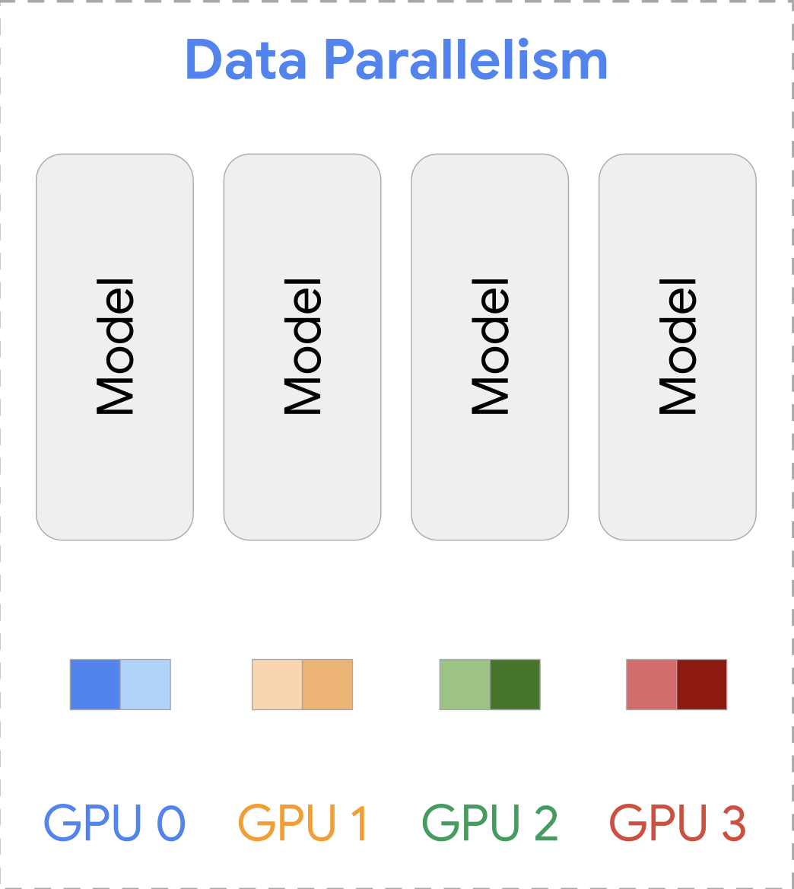
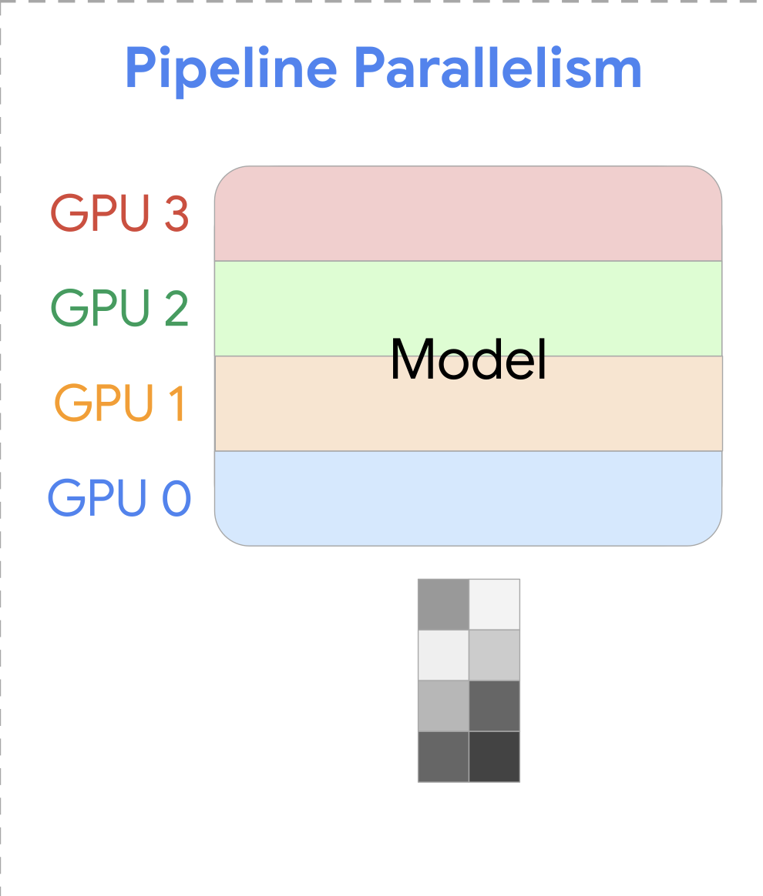
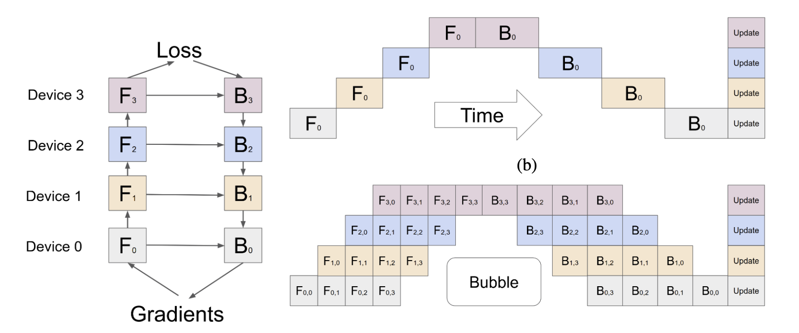
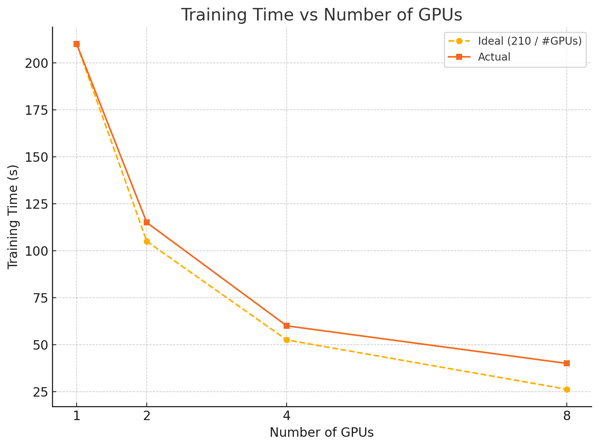

# Single GPU vs Multi-GPU training
- Training ML models could be intense
  - Heavy computations
  - Large Model
- That's why we might need use multiple GPUs to train
  - GPUs could be accross multiple nodes
- Multi-GPU or Multi-Node training has a over head
  - Communication costs
  - Distributation of the data

# Single-GPU Training

  {width=25%}

  - <small>How it works: Entire model & data on one GPU.</small>
  - <small>Pros: Simple, fast for small models.</small>
  - <small>Cons: Not scalable to large models/datasets.</small>

# Data Parallelism (DP)

  {width=50%}

  - <small>Copy model to each GPU.</small>
  - <small>Split inputs across GPUs.</small>
  - <small>Compute forward/backward.</small>
  - <small>Aggregate gradients.</small>

    

# Naive Pytroch Data Parallelism (DP)
  {width=75%}

# Naive Pytroch Data Parallelism (DDP)
  {width=75%}

# DDP vs DP
- DP is Python threads-based, DDP is multiprocess-based 
  - No Python threads limitations, such as GIL
- Simpler data flow
- High inter-GPU communication overhead
- Overlapping pipeline of gradient all-reduce with layer gradient computation

# Pipeline Parallelism

  {width=60%}

  <small>Idea: Split model layer-wise across GPUs.</small>
  <small>Each GPU processes part of the model sequentially, like a factory pipeline.</small>
  <small>Maximizes compute by overlapping stages (with microbatching).</small>

# Bubble issue and GPipe

  {width=80%}
  - <small>Picture from [GPipe Paper, arXiv:1811.06965](https://arxiv.org/abs/1811.06965)</small>

- GPipe divided the data to micro-batch to reduce the bubble issue.

# Tensor Parallelism

  {width=60%}

  - <small>Send layers or blocks to different GPUs.</small>
  - <small>Transfer outputs between GPUs manually.</small>

  

# How TP works?

  {width=80%}

# Reality: 3D Parallelism

  {width=40%}

- In real world: Data Parallel + Tensor Parallel + Pipeline Parallel are combined.
- Example: Training GPT-3 used all three.

# ZeRO: Advance Data Parallelism

  {width=40%}

- Problem with Normal DP: Full optimizer states and gradients duplicated on every GPU.
- ZeRO Idea: Partition optimizer states, gradients, and parameters across GPUs.
- Result: Train MUCH larger models without running out of memory.

# Multi-GPU performance

  {width=40%}

- ResNet152 with CIFAR100 multi-gpu performance

# Summary
- Model fits onto a single GPU -> DDP or ZeRO
- Model doesn’t fit onto a single GPU
  - Fast intra-node/GPU connection -> PP, ZeRO, TP
  - Without intra-node/GPU connection -> PP
- Largest Layer not fitting into a single GPU -> TP
- Multi-Node / Multi-GPU:
  - ZeRO - as it requires close to no modifications to the model
  - PP+TP+DP: less communications, but requires massive changes to the model
  - DP+PP+TP+ZeRO-1: when you have slow inter-node connectivity and still low on GPU memory
