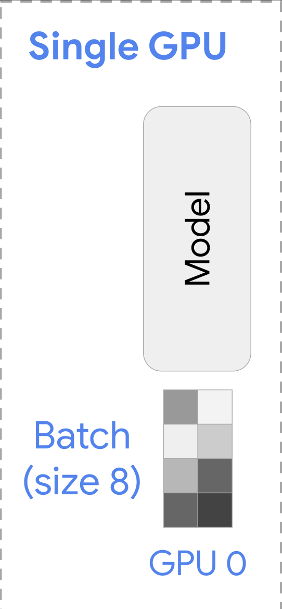

# Scaling PyTorch Models: Single vs Multi-GPU Training and Techniques

# Agenda
- Single-GPU Profiling
- Data Parallelism
    - Basic Data Parallel (DP)
    - ZeRO Data Parallel (DeepSpeed)

- Model Parallelism
    - Tensor Parallelism
    - Pipeline Parallelism

- Profiling and Analysis

# Why Profiling Matters
- Visualize computation, memory, communication.
- Identify bottlenecks early.
- Optimize GPU usage efficiently

# Model Parameters and GPU FLops
- Floating point operations per second
- Simple example

# Signle-GPU Training

  {width=20%}

- How it works: Entire model & data on one GPU.
- Pros: Simple, fast for small models.
- Cons: Not scalable to large models/datasets.

# Data Parallelism (DP)

  {width=80%}

- Simple Idea: Split the batch across multiple GPUs.
    1. Copy model to each GPU.
    2. Split inputs across GPUs.
    3. Compute forward/backward independently.
    4. Aggregate gradients (AllReduce).
- How it affects the Flops

# Model Parallelism - Tensor Parallelism

  {width=80%}

- Idea: Split each layer’s weights across multiple GPUs.
    1. Send layers or blocks to different GPUs.
    2. Transfer outputs between GPUs manually.
- How it affects the Flops

# Model Parallelism - Pipeline Parallelism

  {width=80%}

- Idea: Split model layer-wise across GPUs.
- Each GPU processes part of the model sequentially, like a factory pipeline.
- Maximizes compute by overlapping stages (with microbatching).

# Realliity: 3D Parallelism

  {width=80%}

- In real world: Data Parallel + Tensor Parallel + Pipeline Parallel are combined.
- Example: Training GPT-3 used all three.

# Advance Data Parallelism - ZeRO and DDP

  {width=80%}

- Problem with Normal DP: Full optimizer states and gradients duplicated on every GPU.
- ZeRO Idea: Partition optimizer states, gradients, and parameters across GPUs.
- Result: Train MUCH larger models without running out of memory.

# Demo: PyTorch Profiler
- Track CPU and GPU activities.
- Measure compute time, memory usage, communication overhead.
- Visualize using TensorBoard
- Demo
    1. Single-GPU Profiling
    2. Data Parallel Profiling
    3. Model Parallel Profiling
    4. TensorBoard Visualization

# Excerices
- How much is the communication overhead?
- How to reduce communication overhead?
- How to better split model for model parallelism?
- Can we balance GPU loads better?