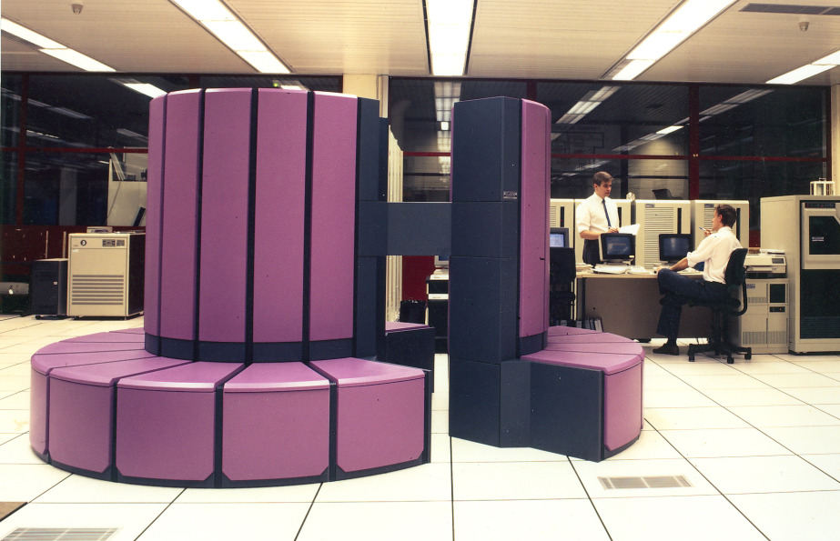
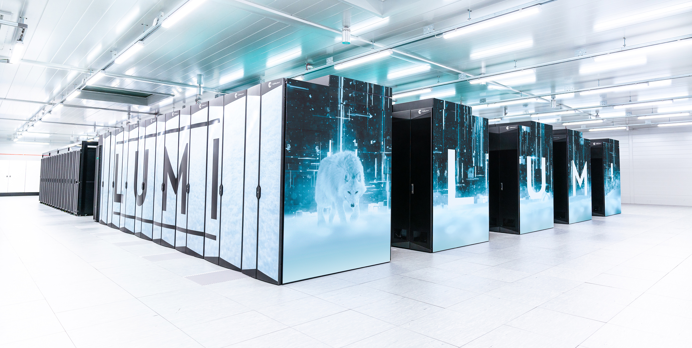

# Outline

*High-performance computing (HPC) is the use of supercomputers and computer clusters to solve advanced computation problems.* 
− [Wikipedia](https://en.wikipedia.org/wiki/High-performance_computing)
 
 

- Why to use supercomputers?
- What are supercomputers?
- Future of high-performance computing

# Why to use supercomputers? {.section}

# Supercomputer application areas

- Supercomputers enable solving computation problems that are impossible or too slow to solve on a standard computer
- Application areas are everywhere
  - Climate, weather, and earth sciences
  - Chemistry and material science
  - Particle physics and cosmology
  - Life sciences and medicine
  - Renewable energy and fusion research
  - Engineering
  - Large-scale AI
  - ...

# Climate and weather research

- Simulating ice sheets, air pollutants, sea-level rise etc.
- Building short and long-term simulations
- Simulated areas can span over countries or continents
- Modeling space weather

{.center width=90%}

# Covid-19 fast track with Puhti

- Modeling particles in airflows
- A large part of the calculations used for solving turbulent flow
- A third of Puhti was reserved for running the simulations
- The results have had an impact on e.g. ventilation instructions and the use of masks

{.center width=100%}

#  Topological superconductors

- Topological superconductors are possible building blocks for qubits
- Based on an elusive quantum state of electrons in thin layers
- Electronic properties simulated with the density-functional theory
  - These confirm that experimentally measured signals are due to this special quantum state

{.center width=100%}

# Large-scale AI

- [Training LLMs](https://lumi-supercomputer.eu/scaling-the-pre-training-of-large-language-models-of-100b-parameters-to-thousands-of-amd-mi250x-gpus-on-lumi/)
  - [OpenEuroLLM](https://lumi-supercomputer.eu/open-euro-llm/)

<!-- Source: Adobe Stock, CC BY-SA 3.0 -->
 {.center width=100%}

# What are supercomputers? {.section}

# Early supercomputers

- Specialized hardware, substantially faster than other computers at the time
- Examples
  - CDC 6600 (1964): 
    CPU 10 MHz, 982 kB RAM
  - Cray-1 (1975): 
    CPU 80 MHz, 8.4 MB RAM
  - Cray X-MP (1982): 
    CPU 4x ~110 MHz, 128 MB RAM

{.center width=100%}
Cray X-MP at CSC (1989) 
Image: CSC Archives

# Current supercomputers

- Large computer clusters
- A lot of standard, high-end server hardware connected to each other
- High-speed interconnect between compute nodes
- Example: LUMI
  - 2064 CPU nodes (~260,000 CPU cores in total)
  - 2978 GPU nodes (~12,000 MI250X GPUs in total)

{.center width=100%}
EuroHPC JU LUMI (HPE Cray EX)  at CSC (2021–)

# Computer clusters

animation...

# Computer clusters and supercomputers

- A computer cluster is a set of computers connected to each other
- The cluster is visible for the user as a single system
- Most current supercomputers are very large computer clusters

 
 

**A supercomputer is not a single "super fast" processor, but a set of hundreds of thousands (or more) processing units that *can be programmed* to work together**  
&rarr; *Parallel algorithms* are needed to utilize supercomputer

# Performance of supercomputers

- Performance is often measured in floating point operations per second (flop/s)
- [LUMI (GPU partition)](https://top500.org/system/180048/)
  - Linpack: 380 PFlop/s (FP64)
  - (Theoretical: 530 PFlop/s (FP64))
  - Power: 7.1 MW &rarr; 54 GFlop/s/W (FP64)
- [LUMI (CPU partition)](https://top500.org/system/180045/)
  - Linpack: 6.3 PFlop/s (FP64)
  - (Theoretical: 7.6 PFlop/s (FP64))
  - Power: 1.2 MW &rarr; 5.3 GFlop/s/W (FP64)

{.center width=100%}
Image: [top500.org](https://top500.org/)

# What are supercomputers made of? {.section}

# CPU frequency development

- Power consumption of CPU: $~f^3$

 {.center width=45%}

# Parallel processing

- Modern (super)computers rely on parallel processing
- **Multiple** CPU cores & accelerators (GPUs)
  - LUMI-G has ~12,000 GPUs together with ~190,000 CPU cores
  - LUMI-C has ~260,000 CPU cores
- Vectorization
  - A single instruction can process multiple data (SIMD)
- Instruction level parallelism and pipelining
  - Core executes multiple instructions in parallel (superscalar execution)
  - Core executes different parts of instructions in parallel

# Anatomy of a supercomputer

<!-- Copyright CSC -->
 {.center width=55%}

- Supercomputers consist of nodes connected by a high-speed network
  - Latency `~`1 µs, bandwidth `~`100 GB / s
- A node can contain several multicore CPUs and several GPUs
- Memory within the node is directly usable by all CPU cores

# Supercomputer autopsy – Lumi

 {.center width=50%}

# From laptop to Tier-0

<!-- Copyright CSC -->
 {.center width=80%}

- The most fundamental difference between a small university cluster and Tier-0 supercomputer is the number of nodes
  - The interconnect in supercomputers is often also more capable

# Future of high-performance computing {.section}

# Cloud computing vs high-performance computing

- Many similarities
  - Both enable remote execution of computations on a computer system with more computing power
- Many differences
  - Different software and computing environment
  - HPC: maximal performance (incl. high-end, tuned hardware and software) &rarr; for tightly coupled workloads
  - Cloud: flexibility, fault-tolerance &rarr; for loosely coupled workloads
- HPC-as-a-Service changing the "traditional" way to use HPC
  - [HEAppE](https://heappe.eu), [LEXIS](https://lexis-project.eu), ...

# Quantum computing

- Solving certain types of problems exponentially faster than classical computers
- General purpose quantum computer is still far away
- Use cases still largely experimental
- Hybrid approaches

{.center width=50%}

# Post-exascale challenges

- Performance of supercomputers has increased exponentially for a long time
- However, there are still challenges in continuing onwards from exascale supercomputers ($> 1 \times 10^{18}$ Flop/s)
  - Power consumption: the exascale supercomputers consume >20 MW
  - Manufacturing: Transistor sizes being extremely small
  - Application scalability: how to program for 100,000 GPUs / 100,000,000 CPU cores?

# Summary {.section}

# Utilizing HPC in scientific research

<!-- Copyright CSC -->
 {.center width=40%}

- **Goal for this school: everyone is able to write and modify HPC applications!**

# Summary

- HPC reaches a lot of different fields of research
- Supercomputers base their performance on extreme parallelism
    - And GPUs nowadays
- Cloud computing as an option for accessing HPC resources
- The future of HPC looks bright but presents unique challenges
