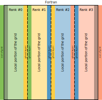

## Heat equation solver in parallel with MPI

Parallelise our implementation of a two-dimensional heat equation solver using
MPI. See [Code description](code-description.md) for some theory and more
details about the code.

To parallelise the code, one needs to divide the grid into blocks of columns
(in Fortran) or rows (in C/C++) and assign each block to one MPI task. Or in other
words, share the work among the MPI tasks by doing a domain decomposition.

The MPI tasks are able to update the grid independently everywhere else than
on the boundaries -- there the communication of a single column (or row) with
the nearest neighbour is needed. This can be achieved by having additional
ghost-layers that contain the boundary data of the neighbouring tasks. As the
system is aperiodic, the outermost ranks communicate with only one neighbour,
and the inner ranks with two neighbours.

## Tasks

1. [First steps](#first-steps)
2. [Using sendrecv](#using-sendrecv)
3. [Using non-blocking communication](#using-non-blocking-communication)
4. [Using collective communication](#using-collective-communication)
5. [Using Cartesian communicator](#using-cartesian-communicator)
6. [2D decomposition](#2d-decomposition)

### First steps

Some parts of the code are already parallelized (*e.g.* input/output), complete
the parallelization as follows (marked with TODOs in the source code):

1. Initialize and finalize MPI in the main routine
   - in [cpp/main.cpp](cpp/main.cpp) or
   - in [fortran/main.F90](fortran/main.F90)
2. Determine the number of MPI processes, rank, as well as the left (or up) and right (or down) neighbours of a domain
   - in the `ParallelData()` constructor in [cpp/heat.hpp](cpp/heat.hpp) or
   - in the routine `parallel_setup()` in [fortran/heat_mod.F90](fortran/heat_mod.F90)
3. Use `MPI_Send` and `MPI_Recv` for implementing the "halo exchange" operation in the `exchange()` routine
   - in [cpp/core.cpp](cpp/core.cpp) or
   - in [fortran/core.F90](fortran/core.F90)

To build the code, please use the provided `Makefile` (by typing `make`).

There is also working serial code under [cpp/serial](cpp/serial) / [fortran/serial](fortran/serial)
which you can use as reference.

### Using sendrecv

Before starting with this exercise, complete [the first steps](#first-steps).
You can also use its model solution as starting point.

1. Use `MPI_Sendrecv` for implementing the "halo exchange" operation in the `exchange()` routine
   - in [cpp/core.cpp](cpp/core.cpp) or
   - in [fortran/core.F90](fortran/core.F90)

### Using non-blocking communication

Before starting with this exercise, complete [the first steps](#first-steps).
You can also use its model solution as starting point.

Utilize non-blocking communication in the "halo exchange".
The aim is to be able to overlap the communication and communication. In order to achieve this,
you need to divide the communication and computation into four steps:

1. Initiate the communication in the halo exchange
2. Compute the inner values of the temperature field (those that do not depend on the ghost layers)
3. Finalize the communication in halo exchange
4. Compute the edge values of the temperature field (those that depend on the ghost layers)

Implement the required routines in [cpp/core.cpp](cpp/core.cpp) or [fortran/core.F90](fortran/core.F90),
and replace the calls to `exchange` and `evolve` in the `main` routine by the newly implemented ones.

### Using collective communication

Before starting with this exercise, complete [the first steps](#first-steps).
You can also use its model solution as starting point.

Implement collective communication in the code.

1. Replace the individual sends and receives in the routine `average` with appropriate collective communication
   - in [cpp/utilities.cpp](cpp/utilities.cpp) or
   - in [fortran/utilities.F90](fortran/utilities.F90)
2. Replace the individual sends and receives in the routine `read_field` with appropriate collective communication
   (note that the code needs to be run with the initial data read from an input file found under the [common](common) directory: `srun ./heat_mpi bottle.dat`)
   - in [cpp/io.cpp](cpp/io.cpp) or
   - in [fortran/io.F90](fortran/io.F90)
3. Is it possible to use collective communications also in the routine `write_field`?
   - in [cpp/io.cpp](cpp/io.cpp) or
   - in [fortran/io.F90](fortran/io.F90)

### Using Cartesian communicator

Before starting with this exercise, you need to have a working parallel code from the previous exercises.
You can also use its model solution as starting point.

The current version uses only `MPI_COMM_WORLD`, and neighboring process are determined manually.

1. Add a "communicator" attribute to the basic parallelization data structure
   - class `ParallelData` in [cpp/heat.hpp](cpp/heat.hpp) or
   - `type :: parallel_data` in [fortran/heat_mod.F90](fortran/heat_mod.F90)
2. Create the Cartesian communicator in and use `MPI_Cart_shift` for determining the neighboring processes
   - in `ParallelData()` constructor in [cpp/heat.hpp](cpp/heat.hpp)
   - in `parallel_setup()` in [fortran/heat_mod.F90](fortran/heat_mod.F90)
3. Use the Cartesian communicator in all communication routines

### 2D decomposition

Before starting with this exercise, it is recommended that you have
[the Cartesian communicator](#using-cartesian-communicator) implemented.
You can also use its model solution as starting point.

1. Modify the creation of Cartesian communicator so that the
   decomposition is done in two dimensions, and determine all four
   neighbors (up, down, left, right).
2. As the rows (in Fortran) or columns (in C++) are not contiguous
   in the computer memory, one needs to use user-defined datatypes
   when communicating in the `exchange()` routine in [cpp/core.cpp](cpp/core.cpp)
   or [fortran/core.F90](fortran/core.F90). In order to make code more
   symmetric, one can utilize derived type also for the contiguous
   dimension. Create required datatypes (it is recommended to store
   them as attributes in "parallel" data structure).
3. Perform the halo exchange with `MPI_Neighbor_alltoallw`. Together
   with the user defined datatypes, no temporary buffers are needed in
   the user code. In order to use `MPI_Neighbor_alltoallw`, you need
   to determine the correct `displacements` both in sending and
   receiving.
4. In the base version, the I/O routines `write_field` and
   `read_field` (in [cpp/core.cpp](cpp/io.cpp) or
   [fortran/core.F90](fortran/io.F90))
   use temporary buffers for communication. Create appropriate
   datatype and utilize it in I/O related communication. Note that you
   need also the coordinates of processes in the cartesian grid in
   order to read from / write to the correct part of the global
   temperature field.

