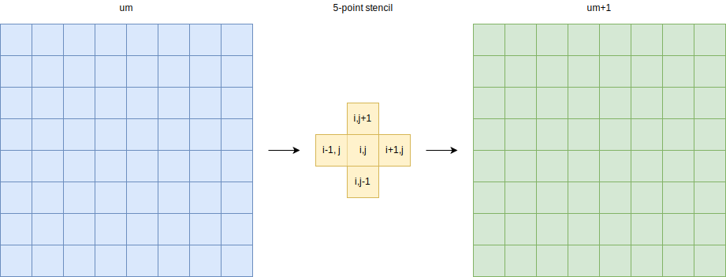

<!-- Adapted from material by ENCCS -->

# Heat equation in 2D

## Heat diffusion

Heat flows in objects according to local temperature differences, as if seeking local equilibrium.
Such processes can be described with partial differential equations and modeled numerically
via discretization to a regular grid. Solving for the flow over time can involve a lot of
computational effort. Fortunately that effort is quite regular and so can suit parallelization
with a variety of techniques.

### Theory

The rate of change of the temperature field $u(x, y, t)$ over two spatial
dimensions $x$ and $y$ and time $t$
with diffusivity $\alpha$ can be modelled via the partial differential equation

$$\frac{\partial u}{\partial t} = \alpha \nabla^2 u$$

where $\nabla^2$ is the Laplacian operator, which describes how
the temperature field varies with the spatial dimensions $x$ and
$y$. When those are continuous variables, that looks like

$$\frac{\partial u}{\partial t} = \alpha \left( \frac{\partial^2 u}{\partial x^2} + \frac{\partial^2 u}{\partial y^2}\right)$$

Because computers are finite devices, we often need to solve such
equations numerically, rather than analytically.
This often involves *discretization*, where spatial and temporal
variables only take on specific values from a set.
In this mini-app we will discretize all three dimensions $x$, $y$, and
$t$, such that

```math
\begin{align*}
\nabla^2 u  &= \frac{u(i-1,j)-2u(i,j)+u(i+1,j)}{(\Delta x)^2} \\
 &+ \frac{u(i,j-1)-2u(i,j)+u(i,j+1)}{(\Delta y)^2}
\end{align*}
```
where $u(i,j)$ refers to the temperature at location with
integer index $i$ within the domain of $x$ spaced by $\Delta x$ and location
with integer index *j* within the
domain of $y$ spaced by $\Delta y$.

Given an initial condition ($u(t=0) = u^0$), one can follow the time
dependence of the temperature field from state $m$ to $m+1$ over
regular time steps ∆t with explicit
time evolution method:

$$u^{m+1}(i,j) = u^m(i,j) + \Delta t \alpha \nabla^2 u^m(i,j)$$

Note: The algorithm is stable only when

$$\Delta t \leq \frac{1}{2 \alpha} \left(\frac{1}{\Delta x^2} + \frac{1}{\Delta y^2}\right)^{-1}$$

This equation expresses that the time evolution of the temperature
field at a particular location depends on the value of the field at
the previous step at the same location *and* four adjacent locations:



### Parallelization

The problem can be parallelized by diving the two dimensional
temperature field to different workers, *i.e*. doing domain
decomposition. With shared memory computers the parallelization is
relatively straightforward, however, with distributed memory
parallelization with MPI some extra steps are needed.

Here we describe one-dimensional domain decomposition. Due to different
memory layout in Fortran and C/C++, the grid is divided into blocks of columns
in Fortran or into rows in C/C++ and each block is assigned to one
MPI task.

The MPI tasks are able to update the grid independently everywhere else than
on the boundaries -- there the communication of a single column (or row) with
the nearest neighbour is needed. This can be achieved by having additional
ghost-layers that contain the boundary data of the neighbouring tasks. As the
system is aperiodic, the outermost ranks communicate with only one neighbour,
and the inner ranks with two neighbours.


### Code

The solver carries out the time development of the 2D heat equation over the
number of time steps provided by the user. The default geometry is a flat
rectangle (with grid size provided by the user), but other shapes may be used
via input files -- a bottle is given as an example in
[common/bottle.dat](common/bottle.dat).

Examples on how to run the binary:
- `./heat`  (no arguments - the program will run with the default arguments:
             2000x2000 grid and 500 time steps)
- `./heat bottle.dat` (one argument - start from a temperature grid provided
                       in the file `bottle.dat` for the default number of time
                       steps)
- `./heat bottle.dat 1000` (two arguments - will run the program starting from
                            a temperature grid provided in the file
                            `bottle.dat` for 1000 time steps)
- `./heat 4000 8000 1000` (three arguments - will run the program in a
                           4000x8000 grid for 1000 time steps)

The program will produce an image (PNG) of the temperature field after every
500 iterations. You can change the frequency by modifying the parameter
`image_interval` in [main.c](cpp/main.cpp) (or [main.F90](fortran/main.F90)).
You can also visualize the images e.g. with
`animate -resize 25% -delay 100 heat_*.png`
or
`eog heat_0100.png'

