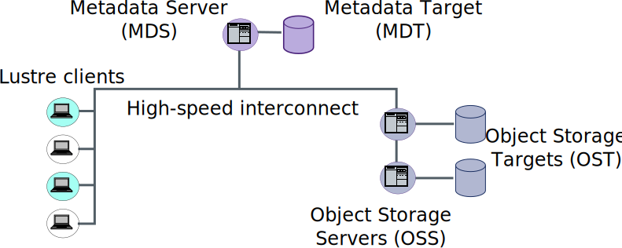
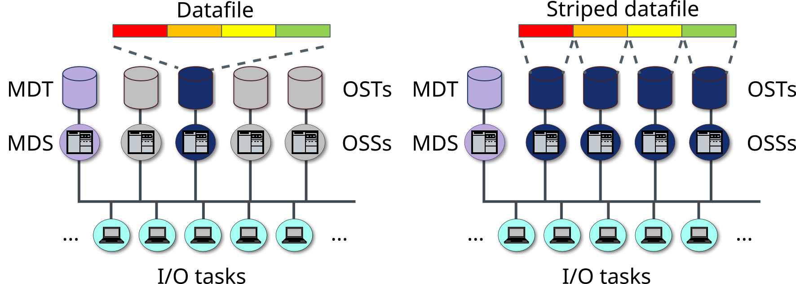
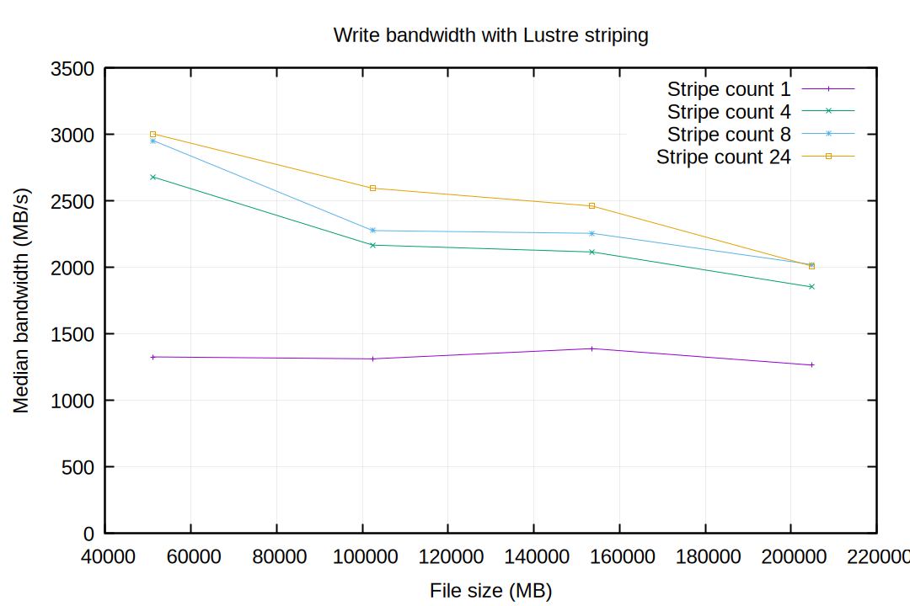

# Common I/O use cases in HPC

- Write simulation results on disk
- Write full state of the simulation, eg. for visualization or as a checkpoint for continuing later
- Read configuration files, input parameters, earlier checkpoint files...

**Heavy I/O can become a bottleneck if not properly planned for!**

- Example: Run of the climate simulation code `ICON` produces 700 TB of data, at rate of 100 MB/s (30-year model)
- Mahti peak I/O has been measured at 1.5 GB/s per compute node

<!-- ICON numbers obtained from JE. They correspond to a "recent" (2025) simulation for `ClimateDT` using 5km resolution.
Mahti numbers are from https://docs.csc.fi/computing/lustre/ -->


# What is covered on these slides

- Common strategies for parallel I/O and their limitations
- Using file I/O routines included in MPI for parallel I/O (MPI-IO)
- Controlling file striping in Lustre for better I/O performance
- Short introduction to standardized file formats used in HPC
    - Focus mostly on HDF5

# Common I/O strategies in HPC {.section}

# I/O and POSIX (Portable Operating System Interface)

Most Linux systems follow the POSIX standard:

- File I/O happens through POSIX syscalls `read()`, `write()` etc.
- Standard library routines `fread()`, `fwrite()` call POSIX under the hood
    - Can call POSIX directly in C (header `unistd.h`), but this is rarely needed

However, **strict POSIX semantics are not well suited for parallel I/O!**

- Eg. "global consistency": writes must be immediately visible to all processes
- Lustre is POSIX compliant. Parallel applications must work around the I/O limitations through smart implementations (MPI-IO)

# Old school parallel I/O

Small programs _can_ manage with standard I/O routines:

- Do all I/O from one process, using MPI to gather/scatter the data (**"spokesperson"**)
- Use separate I/O file(s) for each process (**"file-per-process"**)
- Coordinated I/O to one file from many processes, eg. `fseek()` based on MPI rank

MPI-IO essentially implements a scalable combination of these ideas.

- Still useful to understand how these approaches would work in isolation

# Spokesperson strategy: One I/O process

<div class="column">
- One process takes care of all I/O using standard, serial routines (`fprintf`, `fwrite`, ...)
- Usually requires a lot of MPI communication
- Can be a good option for small files (eg. reading input files)
- Does not scale, single writer is a bottleneck!
</div>
<div class="column">

</div>

<small>Exercise: first part of `parallel-write`</small>

# File-per-process I/O

<div class="column">
- Each process writes its local results to a separate file
- Good bandwidth, easy to implement
- Having many files makes data post process cumbersome
- **Can overwhelm the filesystem!**

  - Recall discussion of Lustre metadata servers
</div>

<div class="column">

</div>

# Programs with dedicated I/O processes ("I/O servers")

- Variation of "spokesperson": One or more MPI processes that *only* do I/O
- I/O is done asynchronously, in parallel with computations &rarr; can be great for I/O-heavy programs
- Pseudocode example:

<div class="column">
**Compute processes**
```python
while simulation_is_running:
    evolve_system()
    if checkpoint:
        # Wait until our previous send
        # has been processed by the server
        MPI_WAIT(send_req)
        send_buffer = data
        MPI_ISend(IO_SERVER, send_buffer)
```
</div>

<div class="column">
**I/O server**
```python
while simulation_is_running:
    for rank in compute_processes:
        MPI_Recv(rank, recv_buffer)
        write(buffer)
```
</div>


# Comments on standard I/O streams

The "standard" I/O streams `stdout`, `stdin`, `stderr` are effectively **serial** in `mpirun`/`srun` context!

- *Eg*: Default `srun` will redirect `stdout` of all processes to `stdout` of `srun`
- Avoid excessive debug prints in production runs
    - Separate "Debug" and "Release" builds if needed
- **Do not** rely on standard streams for heavy I/O operations. Code for direct file I/O instead
    - *Eg*: `fprintf` instead of `printf`

# Parallel I/O with MPI-IO {.section}

# MPI parallel I/O interface (MPI-IO)

MPI-IO = part of the MPI specification that deals with I/O.

- Provides built-in solutions for parallel I/O involving many MPI processes

- Modern replacement for the "old school" I/O strategies discussed earlier

- **Portable**: Specifics about the filesystem are abstracted away

- Implementations: `ROMIO` (both in `MPICH` and `OpenMPI`) and `OMPIO` (`OpenMPI` only)
    - Advanced users can configure the internals via "hints"

<small>Exercise: second part of `parallel-write`</small>

# MPI-IO example

```c
// Remember to #include <mpi.h>

MPI_File file;
// Creates file called "stuff.out" and opens it in write-only mode.
// The "info" parameter can be used for implementation-specific hints.
MPI_File_open(MPI_COMM_WORLD, "stuff.out",
    MPI_MODE_CREATE | MPI_MODE_WRONLY, MPI_INFO_NULL, &file);

// Compute a file offset (in bytes), ie. where in the file this rank should perform the write.
MPI_Offset offset = (MPI_Offset) (rank * N * sizeof(int));

// Write N integers from each rank from pointer 'data_ptr' to position specified by the offset.
MPI_File_write_at(file, offset, data_ptr, N, MPI_INT, MPI_STATUS_IGNORE);

// Or using collective MPI_File_write_at_all(), which can be more performant for large writes.
MPI_File_write_at_all(file, offset, data_ptr, N, MPI_INT, MPI_STATUS_IGNORE);

MPI_File_close(&file);
```

# Collective I/O in MPI

- Some MPI-IO routines, like `MPI_File_write_at_all()`, are **collective**:
    - Must be called by all ranks that have the file open
    - Lets MPI optimize. For example, it can create internal *aggregator tasks* for handling the filesystem I/O

{.center width=60%}
<small>*Figure from https://docs.csc.fi/support/tutorials/lustre_performance/*</small>

# Lustre file striping {.section}

# Lustre filesystem recap

{.center width=100%}

**Striping** = how the file is distributed across OSTs

# File striping

With striping, many OSTs can participate in single-file I/O

- Can have simultaneous read/write by many physical disks!



# Controlling Lustre striping

- Striping pattern of a file/directory can be queried or set with the
  `lfs` command
- `lfs getstripe` <*dir*|*file*>
- `lfs setstripe` -c *count* *dir*
    - Set the default stripe count for directory *dir* to *count*
    - All new files/subdirectories within the directory will have the specified striping
    - Also the stripe size can be specified. Default is usually 1 MB

- Default stripe count on Puhti/Mahti/Lumi is 1, *ie.* no striping
- Can also control striping at runtime through Lustre's programming API (`lustreapi.h`)

# Performance with Lustre striping

{.center width=60%}


# Common I/O libraries and file formats {.section}

# File format considerations: binary vs. text

Binary files should be preferred for storing large datasets:

- Smaller file sizes compared to text files (no need for character formatting)
- Choose your file format and structure carefully
    - Creating your own format means only you know how to read them!
    - Prefer standardized formats: `HDF5`, `netCDF` *etc.*

Human-readable text files are common for small configuration/input files.

- Prefer existing standards and parsers: no need to reinvent the wheel
    - `JSON`, `YAML`, `TOML`, `INI`, ...


# High-level I/O libraries

Most popular high-level I/O libraries in HPC are **`HDF5`** and **`netCDF`**.

- Both define hierarchical file formats for storing large binary data
- Both can be compiled with parallel support, using MPI-IO under the hood
- Their data models are complex, but very versatile
    - Mental model: "Database in a single file"
- Modern `netCDF` is actually a layer built upon `HDF5`

# File format of HDF5 (Hierarchical Data Format)

- HDF5 files consist of *datasets* organized into *groups*, and their associated *metadata*
    - In practice, dataset = multidimensional array

<div class="column">

</div>

<div class="column">

</div>


# Using HDF5

- Official programming API for `C`, `C++`, `f90`
    - Quite verbose! Consult the docs: <https://support.hdfgroup.org/documentation/hdf5/latest/_r_m.html>
- Python package: `h5py`. File read example:
```python
import h5py
myFile = h5py.File("some_file.hdf5", 'r') # Behaves like a Python dict
dataset_names = list(myFile .keys())
dataset = myFile['some_dataset']         # Behaves like a NumPy array
```

- HDF5 I/O is supported by many scientific software (`Paraview`, `Matlab`, ...)
- Command line tools for investigating HDF5 files (`h5ls`, `h5dump`)

<small>
See our self-study material on HDF5 API (bonus content)
</small>


# Summary {.section}

# Parallel I/O summary

- Pay attention to your I/O logic in parallel programs - you don't want it becoming a bottleneck
- MPI-IO provides parallelized replacements for standard I/O functions, and more
- Utilize Lustre striping for better parallel I/O performance
- Standardized file formats and libraries exist for storing and manipulating large amounts of complicated data
    - No need to cook up your own format :)
